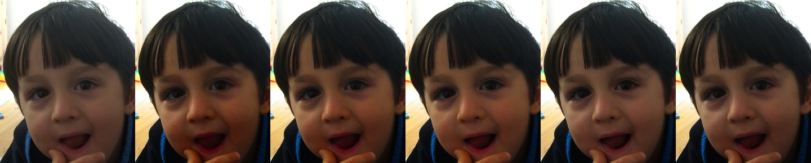

# Face / skin-tone darkening in the starter look: measurement and a proposed fix

**Status: suggestion, not decided.** Measured on one indoor frame
(`source_imx708/2026-09-20/154239`, Pi 4, IMX708, bundled starter after
[Phase 6](2026-09-19-imx708-normalisation.md)). More frames with faces are needed,
above all outdoors, before changing the starter. Nothing in the bundled artifact has
changed for this note.

## The complaint

Indoors the look is good, but faces come out too dark and lose detail: the skin turns
into a flat, dark red-orange area. The rest of the frame is fine.

## Where the darkening comes from

Not the normalisation. The capture record for 154239 shows the Phase 6 normaliser did
nothing to this frame: `gamma 1.0`, `lift_weight 0.0`, white balance off, levels
stretch 1.0013. The whole change is the LUT.

The starter LUT (`pifilm/preset.py`, `starter_lut`) applies an S-curve in Oklab
lightness, `L + 0.065·sin(2π(L − 0.5))`, and multiplies chroma by 1.45. A face in room
light sits at lightness 0.35–0.50, which is the part of the S-curve that darkens, and
the chroma boost then pushes the already-darkened skin toward saturated orange. Both
effects compound on skin in a way they do not on the white walls or the toys.

Measured over the skin pixels of the face (hue 15°–75°, chroma 0.03–0.16, lightness
0.3–0.85, inside the face box; 234 k pixels at full resolution):

| Median over skin pixels | Original | Current starter |
| --- | --- | --- |
| Oklab lightness | 0.405 | 0.364 |
| Linear luminance (BT.709 Y) | 0.064 | 0.046 |
| Oklab chroma | 0.046 | 0.065 |
| 10th-percentile lightness (darkest skin) | 0.339 | 0.282 |
| Mean 8-bit RGB | 96 / 67 / 54 | 93 / 53 / 34 |

Luminance falls by a third. Green and blue fall hardest, so what is left is mostly the
red channel, and shading detail that lived in the green/blue difference is gone.

## The fix that already half exists

`pifilm/experiments/candidates.py` has a `shadows` control that was built for the
[highlight-protected LUT experiment](2026-09-12-highlight-protected-lut.md) but never
evaluated. It cancels a fraction of the S-curve's *negative* lightness delta inside a
skin colour range (hue within 20°–55° of 45°, chroma between 0.01 and 0.20, both edges
smoothstepped). It is a colour-range heuristic, not a face detector, so wood, terracotta
and orange objects in the same range are affected too.

A second knob, not in the code yet, tempers the 1.45× chroma boost inside the same
range (tested at 1.20×).

Tried on 154239, LUT applied directly to the original (normaliser is identity here,
grain off):

| Candidate | Skin lightness | Skin luminance | Skin chroma | Pixels outside the face box moved > 2/255 | Mean change outside the face box |
| --- | --- | --- | --- | --- | --- |
| current starter | 0.364 | 0.046 | 0.065 | 0 % | 0 |
| `shadows=0.6` | 0.382 | 0.053 | 0.065 | 7.1 % | 0.32 / 255 |
| `shadows=1.0` | 0.394 | 0.058 | 0.065 | 7.9 % | 0.56 / 255 |
| `shadows=1.0` + skin chroma 1.20× | 0.394 | 0.059 | 0.054 | 9.9 % | 0.83 / 255 |
| `shadows=0.6` + skin chroma 1.20× | 0.382 | 0.054 | 0.054 | 9.4 % | 0.59 / 255 |

The pixels that move outside the face are the wooden floor and orange toys. Their mean
change stays under one 8-bit step, so the rest of the frame is effectively unchanged.



Columns, left to right: original, current starter, `shadows=0.6`, `shadows=1.0`,
`shadows=1.0` + chroma 1.20×, `shadows=0.6` + chroma 1.20×.

## Suggestion

`shadows=1.0` is the minimal change: skin lightness returns to within 0.011 of the
original while the saturated look is untouched. If faces still read too red, the
chroma 1.20× variant brings skin colour back to near the original as well, at the cost
of a less punchy face.

## Before deciding

1. **Collect faces outdoors.** The one frame here is indoor shade. Outdoors, skin is
   brighter (lightness 0.55–0.70), where the S-curve *lifts* rather than darkens, so the
   `shadows` control does nothing there; the chroma boost, however, still applies. A
   fix chosen on indoor frames alone may be wrong or irrelevant outside. Aim for 10–15
   frames with faces: sun, open shade, backlit, and a couple with more than one skin
   tone.
2. **Check the collateral range.** Frames with wooden floors, brick, terracotta and
   orange objects near faces, to see whether the colour-range mask moves anything the
   eye notices.
3. **Re-run the pilot aggregates.** Grade the 108-shot 2026-09-19 pilot plus the new
   frames under the chosen candidate and confirm the indoor/outdoor clip and shadow
   statistics from the Phase 6 write-up are unchanged.

## If a candidate is chosen

- Move the skin control from `candidates.py` into `starter_lut` (a `shadows` parameter,
  optionally `skin_saturation`), so the bundled starter and the experiments share one
  implementation.
- Regenerate `pifilm/data/pifilm.cube`. Unlike Phase 6 the LUT hash changes, so
  `tests/test_preset.py` and the `lut_sha1` pins move with it.
- Record the values and the numbers above in the preset comment and this document.
- This tunes the untrained starter only. The Phase 5 retrain produces a new LUT from the
  reference set, and skin handling there needs its own check.

## Reproduce

```python
import numpy as np
from PIL import Image
from pifilm.color import srgb_to_oklab
from pifilm.experiments.candidates import candidate_lut
from pifilm.preset import starter_lut

rgb = np.asarray(Image.open("source_imx708/2026-09-20/154239_original.jpg").convert("RGB"),
                 dtype=np.float32) / 255
face = rgb[665:1535, 1740:2460]
for name, lut in {"current": starter_lut(), "shadows=1.0": candidate_lut(shadows=1.0)}.items():
    lab = srgb_to_oklab(lut.apply_numpy(face))
    print(name, "median skin-region L", float(np.median(lab[..., 0])))
```

This prints the median over the whole face box, hair included (0.305 current, 0.333 at
`shadows=1.0`), so the values are lower than the skin-masked table above; the direction and
the size of the recovery are the same.

The chroma-tempered variants are not in the code; they multiply the skin weight into the
saturation term of `candidate_lut` in the same way `shadows` multiplies into the tone
delta.
